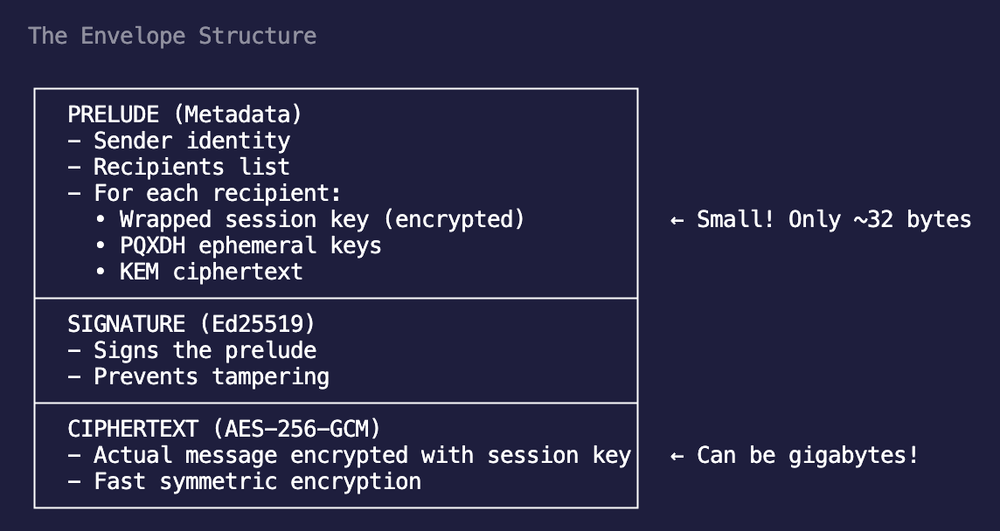

# SBC1 Envelope Format

This document describes the “SBC1” envelope implemented inside the CLI. The JSON sample below still shows placeholder values for readability, but production builds populate those fields with the actual Syft crypto data.

---

## High-Level Goals

- Detect encrypted assets by peeking at a fixed header (`SBC1`) instead of relying on file extensions.
- Carry signer and recipient metadata in a canonical JSON prelude so tooling (`sbc file inspect`) can expose context without touching ciphertext.
- Allow signature verification prior to decryption and support optional payload integrity checks.
- Prevent the need for sidecar files which ensures atomicity when dealing with each file
- Allow for future format / version changes

---

## File Layout

```
┌─────────────┬────────┬──────────────┬─────────────────────┬──────────────┬────────────┐
│ MAGIC(4B)   │ VERSION│ PRELUDE LEN  │ PRELUDE (padded 4K) │ SIG LEN (2B) │ SIGNATURE  │
└─────────────┴────────┴──────────────┴─────────────────────┴──────────────┴────────────┘
                                                                             │
                                                                             ▼
                                                                       CIPHERTEXT STREAM
```

The header is binary. If you dump the file as UTF‑8 you may see odd characters such as `}` right after `SBC1`. That’s simply the little-endian representation of the prelude length (`0x7D` = 125) and signature length (`0x1D` = 29) landing on printable ASCII. Use `hexdump -C` to inspect the structure; you’ll see the magic (`53 42 43 31`), version byte, 4-byte prelude length, canonical JSON prelude (padded to 4 KiB), 2-byte signature length, the detached signature, and finally the ciphertext.

1. **Magic + Version**
   - Magic: ASCII `SBC1`.
   - Version: single byte (`1` for the current version).
2. **Prelude Length**
   - Unsigned 32-bit little-endian integer describing the canonical JSON prelude length (in bytes).
3. **Prelude**
   - RFC 8785 canonical JSON describing signer, recipients, wrapping metadata, cipher info, and optional integrity/public metadata.
   - We use canonical JSON so that there can't be errors in slight changes with the json with different libraries / formatting rules leading to different hashes
   - Padded up to the next 4 KiB boundary with zeros to remain predictable.
4. **Signature Length**
   - Unsigned 16-bit little-endian integer describing the length of the detached signature.
5. **Signature**
   - Signature bytes. Currently this is a deterministic placeholder.
6. **Ciphertext**
   - Remainder of the file: the encrypted payload emitted by the Syft file cipher.



---

## Prelude Schema

```jsonc
{
	"version": 1,
	"canon": "jcs-rfc8785",
	"created_at": 1730338793,
	"sender": {
		"identity": "alice@example.org",
		"ik_fingerprint": "sha256hex...",
	},
	"recipients": [
		{
			"identity": "bob@example.org",
			"device_label": "default",
			"spk_fingerprint": "sha256hex...",
			"signed_prekey_id": 1,
		},
	],
	"recipient_set_fpr": "sha256hex...",
	"wrappings": [
		{
			"recipient_identity": "bob@example.org",
			"device_label": "default",
			"wrap_ephemeral_public": "base64url(x25519)",
			"wrap_ciphertext": "base64url(wrapped_key)",
		},
	],
	"cipher": {
		"suite": "xchacha20poly1305-v1",
		"segment_count": 1,
		"last_segment_bytes": 1234,
		"ciphertext_len": 1234,
		"nonce": "base64urlnonce",
	},
	"integrity": null,
	"public_meta": {
		"filename_hint": "optional_hint.txt",
	},
}
```

Fields correspond to Syft terminology:

- `sender.identity` / `sender.ik_fingerprint` describe the author (later derived from the Ed25519 identity key).
- Each entry in `recipients` mirrors a device binding: signed prekey fingerprint and the signed prekey ID.
- `wrappings` contain X3DH outputs: sender’s ephemeral public key and the wrapped file key for each target device.
- `cipher` summarises the Double Ratchet file-layer stats so `inspect` can report segment sizes without decryption.
- `integrity` will eventually hold a base64url SHA-256 hash of the ciphertext for tamper detection.
- `public_meta` carries small hints (e.g., `filename_hint`) that do not compromise confidentiality.

The JSON is produced via the RFC 8785 canonicalisation helper (`to_jcs_bytes`), ensuring deterministic hashing/signing.

---

## Signing Strategy

- `build_stub_envelope` and `verify_stub_signature` remain in the protocol crate purely as **test helpers** so parsing/unit tests can generate deterministic fixtures without invoking the full crypto stack.
